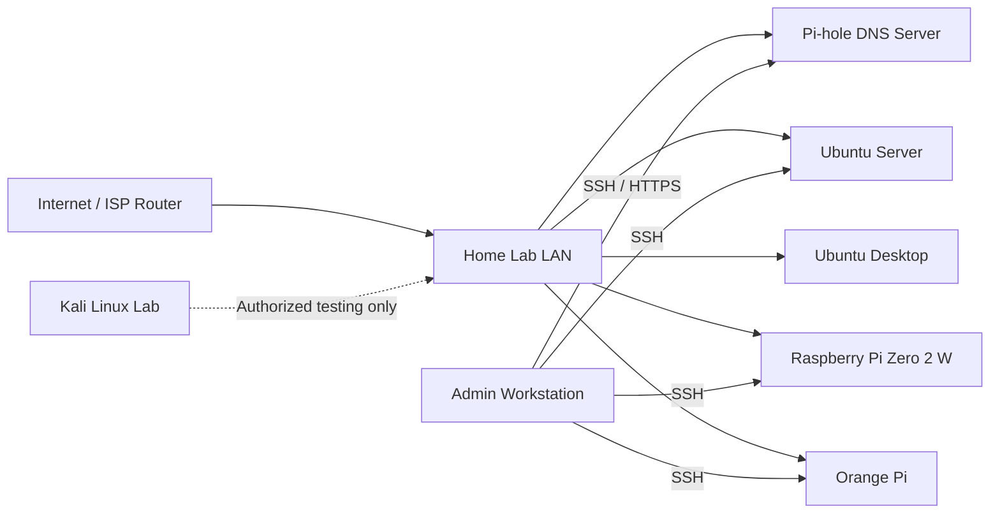

# Raspberry Pi & Linux Labs

A practical portfolio repository documenting hands-on Linux administration, networking, DNS filtering, monitoring, troubleshooting, and defensive-security labs completed with Raspberry Pi and Orange Pi systems.

This repository is designed to demonstrate transferable skills for IT support, service desk, desktop support, junior systems administration, and junior network administration roles. It focuses on installation, configuration, validation, troubleshooting, maintenance, security, and technical documentation.

> **Important:** The documents describe controlled home-lab activities. Replace example values, screenshots, dates, and hardware details with evidence from your own environment before presenting the repository as completed work.

## Repository Objectives

- Document repeatable Raspberry Pi and Linux deployment procedures.
- Demonstrate practical Linux command-line and system administration skills.
- Show understanding of TCP/IP, DNS, DHCP, SSH, Wi-Fi, storage, services, and logs.
- Record troubleshooting methodology instead of only presenting successful outcomes.
- Maintain clear boundaries for authorized defensive-security testing.
- Create portfolio evidence that can be reviewed by recruiters and hiring managers.

## Platforms Covered

- Raspberry Pi 4
- Raspberry Pi Zero 2 W
- Orange Pi
- Raspberry Pi OS
- Ubuntu Server
- Ubuntu Desktop
- Kali Linux in an isolated, authorized lab
- Pi-hole
- Linux monitoring dashboards

## Skills Demonstrated

| Area | Practical Skills |
|---|---|
| Linux administration | Installation, users, packages, services, logs, updates, permissions |
| Networking | Static addressing, DHCP, DNS, routing checks, Wi-Fi, ports, connectivity testing |
| Remote support | SSH configuration, key-based authentication, remote validation |
| DNS filtering | Pi-hole installation, client configuration, query review, allowlists and blocklists |
| Monitoring | System metrics, service health, dashboard deployment, validation |
| Troubleshooting | Boot, DNS, networking, storage, packages, services, peripherals |
| Security | Least privilege, patching, firewall awareness, secure remote access, lab scope |
| Documentation | Procedures, checklists, diagrams, evidence, lessons learned |

## Repository Structure

```text
raspberry-pi-linux-labs/
├── README.md
├── assets/
│   ├── diagrams/
│   ├── screenshots/
│   └── photos/
├── pihole-dns-filtering/
├── ubuntu-server/
├── ubuntu-desktop/
├── monitoring-dashboard/
├── kali-linux-security-lab/
├── raspberry-pi-zero-2w/
├── orange-pi/
└── linux-troubleshooting/
```

## Suggested Lab Environment



## Documentation Standards

Each lab should include:

1. **Purpose** — the problem or skill being addressed.
2. **Environment** — hardware, operating system, network, and dependencies.
3. **Procedure** — repeatable implementation steps.
4. **Validation** — commands or tests proving the configuration works.
5. **Troubleshooting** — symptoms, causes, investigation, and resolution.
6. **Security considerations** — access controls, updates, backups, and scope.
7. **Evidence** — screenshots, diagrams, photos, or redacted logs.
8. **Lessons learned** — what worked, what changed, and what should be improved.

## Evidence Guidelines

Store evidence in the appropriate folder:

- `assets/diagrams/` — architecture and network diagrams.
- `assets/screenshots/` — terminal output, dashboards, and configuration screens.
- `assets/photos/` — hardware, cabling, cases, and physical setup photos.
- `monitoring-dashboard/screenshots/` — dashboard-specific screenshots.

Recommended file naming:

```text
YYYY-MM-DD_lab-name_description.png
```

Examples:

```text
2026-06-14_pihole_dashboard-overview.png
2026-06-14_ubuntu-server_ssh-validation.png
2026-06-14_pi-zero_headless-boot.jpg
```

Before publishing:

- Remove passwords, tokens, private keys, email addresses, public IP addresses, serial numbers, and client information.
- Blur or crop sensitive data.
- Use private example ranges such as `192.168.10.0/24`.
- Do not upload `/etc/shadow`, private SSH keys, authentication cookies, or unrestricted configuration backups.

## How to Use This Repository

1. Select one lab directory.
2. Review the README and supporting documents.
3. Perform the lab only in an authorized environment.
4. Replace example values with your actual lab details.
5. Capture proof of validation.
6. Add sanitized screenshots and photos.
7. Record problems and resolutions.
8. Commit the completed documentation with a clear message.

Example Git workflow:

```bash
git checkout -b lab/pihole-dns-filtering
git add .
git commit -m "Document Pi-hole DNS filtering lab"
git push -u origin lab/pihole-dns-filtering
```

## Portfolio Presentation

A completed lab can be presented on LinkedIn or a resume as:

> Built and documented Raspberry Pi and Orange Pi Linux labs covering Pi-hole DNS filtering, Ubuntu administration, secure SSH access, network configuration, monitoring, maintenance, and structured troubleshooting.

Avoid claiming production-scale or enterprise experience unless the work was performed in that environment. Clearly label home-lab, freelance, volunteer, and professional experience.

## Responsible Use

The Kali Linux section is limited to legal, authorized, defensive-security learning. Do not test systems, networks, applications, or accounts that you do not own or have explicit permission to assess.

## Future Enhancements

- Add Ansible configuration examples.
- Add automated backup scripts.
- Add Prometheus and Grafana monitoring.
- Add UPS monitoring and graceful shutdown.
- Add VLAN segmentation diagrams.
- Add a change log for each lab.
- Add hardware temperature and storage-health baselines.
