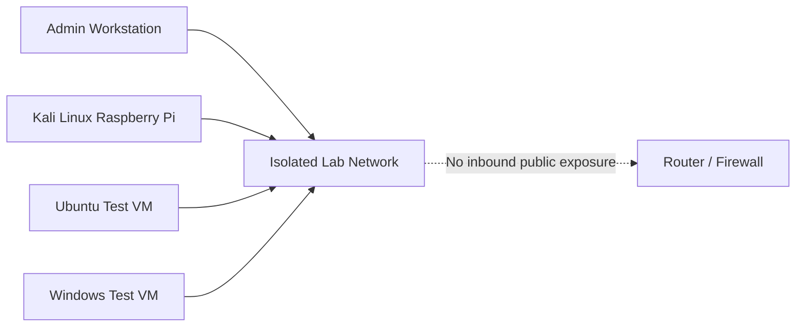

# Kali Linux Defensive Security Lab

## Purpose

This lab documents authorized, isolated, defensive-security learning with Kali Linux on Raspberry Pi hardware. It is intended to demonstrate safe lab planning, asset awareness, service identification, traffic analysis, log review, configuration auditing, and security documentation.

## Authorization Boundary

Only assess:

- Devices you own.
- Virtual machines you created.
- Intentionally vulnerable lab targets you control.
- Networks for which you have explicit permission.

Do not scan, intercept, test, or attempt access against public systems, neighbours, employers, clients, or any device outside the written lab scope.

## Learning Objectives

- Define scope before testing.
- Build an isolated or segmented lab.
- Identify hosts and services in a controlled range.
- Capture and interpret your own test traffic.
- Review Linux logs and configurations.
- Record findings with severity, evidence, and remediation.
- Avoid destructive or exploit-driven activity.

## Safe Lab Example

## Included Documents

- [`lab-scope.md`](lab-scope.md)
- [`defensive-tools.md`](defensive-tools.md)
- [`security-notes.md`](security-notes.md)

## Evidence Guidelines

- Use only private lab addresses.
- Remove MAC addresses when unnecessary.
- Do not publish passwords, hashes, tokens, private keys, or personal traffic.
- Do not upload packet captures containing unrelated user data.
- Prefer screenshots of summarized results rather than raw sensitive data.

## Completion Checklist

- [ ] Written authorization and ownership confirmed.
- [ ] Scope and exclusions recorded.
- [ ] Network isolated or segmented.
- [ ] Test targets documented.
- [ ] Non-destructive methods selected.
- [ ] Data handling plan defined.
- [ ] Findings recorded.
- [ ] Remediation verified.
- [ ] Sensitive artifacts excluded from Git.
