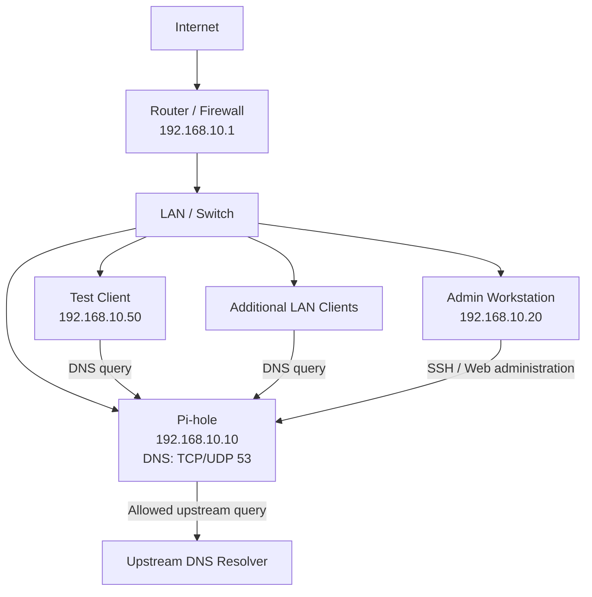
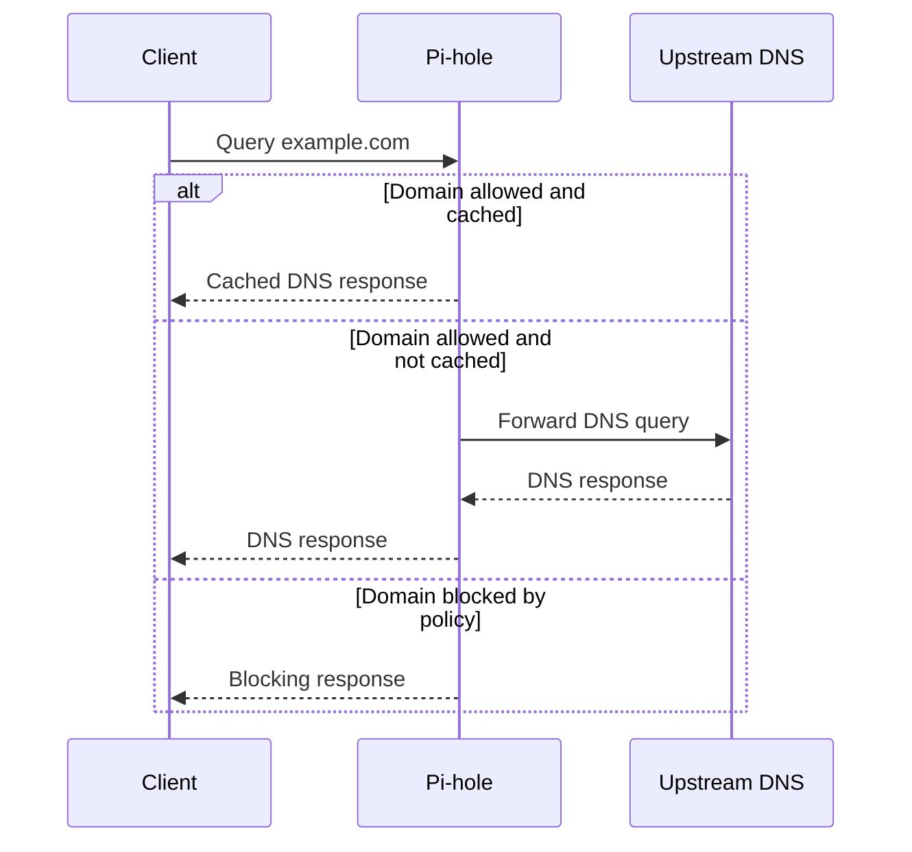

# Pi-hole Network Diagram

## Logical Topology



## DNS Resolution Flow



## Example Addressing Table

| Device | Hostname | Address | Role |
|---|---|---:|---|
| Router/firewall | `gateway01` | `192.168.10.1` | Default gateway and DHCP |
| Pi-hole | `pihole01` | `192.168.10.10` | DNS filtering |
| Admin workstation | `admin-pc` | `192.168.10.20` | Administration |
| Test client | `test-laptop` | `192.168.10.50` | Validation |
| DHCP pool | N/A | `192.168.10.100-199` | Dynamic clients |

## Traffic Requirements

| Source | Destination | Protocol/Port | Purpose |
|---|---|---|---|
| LAN clients | Pi-hole | UDP/TCP 53 | DNS |
| Admin workstation | Pi-hole | TCP 22 | SSH administration |
| Admin workstation | Pi-hole | TCP 80/443 | Web administration |
| Pi-hole | Upstream resolver | UDP/TCP 53 or configured secure method | Forwarded DNS |
| Pi-hole | Package repositories | TCP 80/443 | Updates |

## Design Considerations

- Use a DHCP reservation or documented static address for Pi-hole.
- Prevent accidental exposure of port 53 to the public internet.
- Restrict administration to trusted networks.
- Consider a second internal resolver if DNS availability is critical.
- Do not configure a public secondary DNS on clients if the goal is consistent filtering; clients may bypass Pi-hole.
- Test VPN and guest-network behavior separately.
- Document IPv6 behavior instead of assuming IPv4-only settings cover all DNS traffic.

## Evidence Placeholder

Add a sanitized exported diagram to:

```text
../assets/diagrams/pihole-network-topology.svg
```

Do not include public IP addresses, Wi-Fi passwords, serial numbers, or client names.
